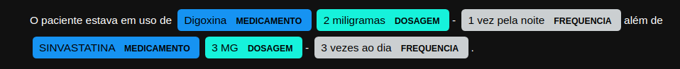

## Desafio 1STi Data Science   

Extrair as entidades nomeadas a partir de um vídeo do youtube.

### Contexto  
A tarefa de Reconhecimento de Entidades Mencionadas ***(Named Entity Recognition)*** tem o objetivo de localizar e classificar elementos do texto em categorias pré-definidas, como pessoas, lugares, organizações, data e outras categorias de interesse.

### Requisitos

* Obter a transcrição de um vídeo do youtube;
    * *Dica: extrair a legenda do vídeo.*
* Obter insights a partir de análise exploratória;
    * *Dica: palavras mais ditas.*
* Aplicar um modelo de reconhecimento de entidades **pré-treinado** utilizando a transcrição como input.
    * *Dica: existem bibliotecas de NLP que facilitam o uso desses modelos.*

### Extra (Não obrigatório)  
* Prototipar a solução utilizando a biblioteca streamlit.
