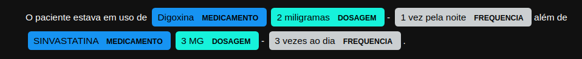

## Desafio 1STi Data Science   

A tarefa de Reconhecimento de Entidades Mencionadas *(Named Entity Recognition)* tem o objetivo de localizar e classificar elementos do texto em categorias pré-definidas, como medicamentos, dosagem, frequência, procedimento, doença, entre outras categorias de interesse.
  
Algoritmos de NER são treinados com uma grande quantidade de dados anotados manualmente, dependendo do domínio, especialistas são utilizados no processo de anotação. No entanto, a tarefa de anotação é custosa, requer muito tempo e esforço dos especialistas, principalmente no domínio de saúde. Para categorias específicas pode ser implementado um modelo **NER baseado em regras**, esse modelo será utilizado para **agilizar o processo de anotação**.

### Objetivo 
Implementar modelo NER baseado em regras para classificação de medicamentos, dosagem e frequência. As regras são:

* **Medicamento:** utilizar base de dados da Anvisa de medicamentos em uso.
* **Dosagem:** utilizar regex para definir os padrões.  
    Ex: 2 comprimidos, 20 miligramas, 15 mg, 5 gotas, 4 puffs, 1000 UI, 3 cápsulas, 300 mililitros.
    
* **Frequência:** utilizar regex para definir os padrões.
    Ex: 1 vez ao dia, 3 vezes na semana, 1 vez pela manhã, 1 vez a noite.  
    
### Extra (Não obrigatório)  
* Prototipar a solução utilizando a biblioteca streamlit.
